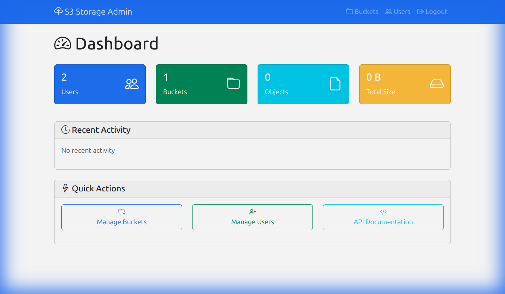
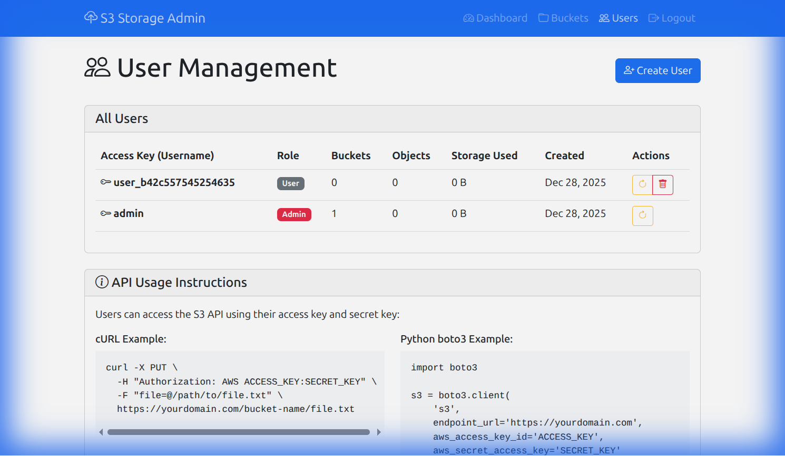
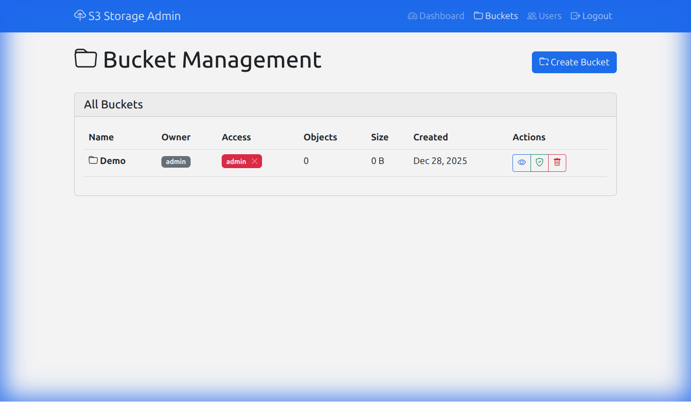

<div align="center">

# 🚀 Lite-S3

### S3-Compatible Object Storage for Shared Hosting

[](https://www.gnu.org/licenses/gpl-3.0)
[](https://php.net)
[](http://makeapullrequest.com)

*Finally, run your own S3 storage on any $5/month shared hosting!*

[Quick Start](#-quick-start) • [Features](#-features) • [Screenshots](#-screenshots) • [API Docs](#-api-usage) • [License](#-license)

</div>

---

## 🤔 What is this?

Ever wanted Amazon S3-like storage but don't want to pay AWS prices? Or maybe you're stuck on shared hosting (cPanel) and can't run MinIO or other S3 alternatives?

**Lite-S3** is a pure PHP implementation of S3-compatible object storage. It works on any hosting that supports PHP and MySQL — yes, even that cheap shared hosting you're already paying for!

## ✨ Features

| Feature | Description |
|---------|-------------|
| 🔌 **S3 Compatible** | Works with AWS SDK, rclone, boto3, s3cmd |
| 👥 **Multi-User** | Each user gets their own credentials |
| 🔐 **Permissions** | Read / Write / Admin per bucket |
| 📁 **Big Files** | Upload files up to 5GB |
| 🎨 **Admin Panel** | Beautiful web UI to manage everything |
| 💾 **Easy Backups** | Plain files + MySQL = simple backups |
| 🏠 **Shared Hosting** | Works on cPanel, DirectAdmin, Plesk |

## 📸 Screenshots

<div align="center">

### Dashboard


### User Management


### Bucket Management


</div>

## 🚀 Quick Start

### For Shared Hosting (cPanel)

1. **Download** this repo and upload `WWW/` contents to your `public_html`
2. **Create MySQL Database** in cPanel → MySQL Databases
3. **Run Installer** at `https://yourdomain.com/install.php`
4. **Delete** `install.php` after setup
5. **Login** with `admin` / `admin123` and **change password!**

### For Docker (Local Testing)

```bash
git clone https://github.com/nityam2007/lite-s3.git
cd lite-s3
docker-compose up -d
# Visit http://localhost:8081/admin/login.php
```

## 🔧 API Usage

### Upload a File

```bash
curl -X PUT \
  -H "Authorization: AWS your_access_key:your_secret_key" \
  -T ./myfile.txt \
  https://yourdomain.com/my-bucket/myfile.txt
```

### Download a File

```bash
curl -H "Authorization: AWS your_access_key:your_secret_key" \
  https://yourdomain.com/my-bucket/myfile.txt -o myfile.txt
```

### With Python (boto3)

```python
import boto3

s3 = boto3.client('s3',
    endpoint_url='https://yourdomain.com',
    aws_access_key_id='your_access_key',
    aws_secret_access_key='your_secret_key'
)

# Upload
s3.upload_file('local.txt', 'my-bucket', 'remote.txt')

# Download  
s3.download_file('my-bucket', 'remote.txt', 'local.txt')
```

### With rclone

```ini
[mycloud]
type = s3
provider = Other
endpoint = https://yourdomain.com
access_key_id = your_access_key
secret_access_key = your_secret_key
```

## 📋 Requirements

- PHP 8.0+
- MySQL 5.7+ or MariaDB 10+
- `mod_rewrite` enabled
- `.htaccess` support

Most shared hosting plans already have all of this! 🎉

## 🔒 Security Notes

1. **Delete `install.php`** after setup
2. **Change default password** immediately  
3. **Use HTTPS** in production
4. **Regular backups** of both DB and storage/

## 💬 Support & Links

- **Author:** Nityam Sheth
- **GitHub:** [@nityam2007](https://github.com/nityam2007)
- **Issues:** [Report bugs](https://github.com/nityam2007/lite-s3/issues)

## 📜 License

This project is licensed under **GNU GPLv3** with attribution requirements.

**You can:**
- ✅ Use commercially
- ✅ Modify and distribute
- ✅ Use for any purpose

**You must:**
- 📌 Keep attribution/credits visible
- 📌 Release modifications under GPLv3
- 📌 Link back to original project

See [LICENSE](LICENSE) for details.

---

<div align="center">

**Made with ❤️ by [Nityam Sheth](https://github.com/nityam2007)**

*If this helped you, give it a ⭐!*

</div>